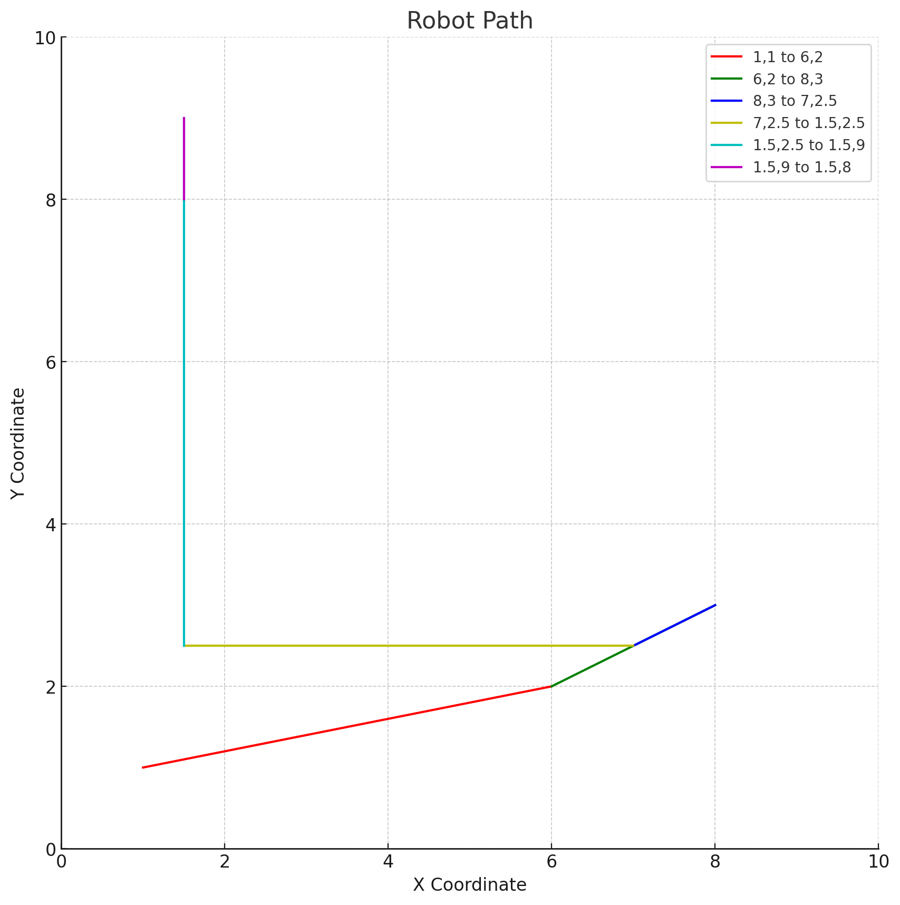

# Development of an Autonomous Robot  
## ENPM701 - Autonomous Robotics  

## Overview  
This project focused on creating an autonomous mobile manipulator capable of executing complex industrial operations. Designed to navigate and perform actions like locating and moving construction blocks within a simulated environment, the robot combines both mobility and manipulation. The project was developed between January 2024 and May 2024.  

## Features  
- **Integrated Design**: The robot merges a mobile platform with a manipulator arm, enabling it to perform a range of tasks.  
- **Autonomous Navigation**: Leveraged landmark-based coordinates for efficient path planning and dynamic obstacle avoidance.  
- **Object Interaction**: Equipped with object detection and differentiation, enabling it to handle obstacles and interact with objects within dynamic surroundings.  
- **Task Optimization**: Prioritized task planning and optimized speed for efficient task execution and completion.  

## Project Structure  
- **Robot Construction**: The autonomous robot was assembled using:  
  - A mobile platform with motors, wheels, and motor controllers.  
  - A Raspberry Pi and camera system for image-based tasks.  
  - Sonar range sensors for detecting distances and obstacles.  
  - A servo-operated gripper for object manipulation.  
- **Control Systems**: Developed around control theory and kinematic models:  
  - Control Algorithms: Based on kinematic models for precision movement in both the mobile base and manipulator.  
  - Sensors and Actuators: Integrated sonar sensors, camera, motors, and gripper to form a complete mechatronic system.  
- **Navigation and Object Handling**: Autonomous navigation incorporated:  
  - Landmark Coordinates: Used for path planning to navigate precisely while avoiding obstacles.  
  - Obstacle Avoidance: Enabled safe interaction with the environment by navigating around obstacles effectively.  

## Methodology  
- **Hardware Integration**: Combined a mobile platform, manipulation arm, and various sensors into a single functional robot. Core components included the Raspberry Pi, motors, sonar sensors, and servo gripper.  
- **Control Algorithm Design**: Control algorithms were created using kinematic and dynamic modeling to ensure accurate positioning and task fulfillment.  
- **Path Planning and Optimization**: Landmark-based path planning allowed the robot to move efficiently between points while avoiding obstacles.  
- **Task Planning**: Designed to improve task speed and efficiency in locating and transporting blocks.  
- **Object Detection and Interaction**: Utilized the Raspberry Pi camera for object detection, with sonar sensors for accurate distance gauging. Image processing methods supported object differentiation and interaction.  

## Key Challenges  
- **Part Recognition**: Developed and adjusted recognition systems to accurately identify parts using vision and sonar input.  
- **Sensor Calibration**: Maintained precise sensor readings by calibrating sonar and camera, essential for consistent navigation and object handling.  
- **Environmental Adaptation**: Built robust control and detection algorithms to ensure reliable performance despite environmental variations like lighting and obstacle changes.  

## Dependencies and Libraries Used  
- **Raspberry Pi OS**: Used to control the robot’s hardware.  
- **OpenCV**: Applied for image processing and object detection.  
- **Python**: Main language for algorithm development and hardware control.  
- **RPi.GPIO**: Utilized for interfacing Raspberry Pi with motors, sensors, and servos.  
- **SciPy and NumPy**: Employed for the computational needs of control algorithms.  

## Key Results  
- **Reliable Task Execution**: The robot successfully navigated autonomously and transported construction blocks in the simulated environment.  
- **Optimized Task Planning**: Efficient path and task planning allowed minimal time per task.  
- **Robust Object Interaction**: Synchronized sensors and manipulator enabled reliable object handling, obstacle avoidance, and adaptability to changing conditions.  

## Robot

## Trajectory

## Progress Video  
Watch the project’s development and outcomes: [Video Link](https://youtu.be/wkC-fCCfk54)
